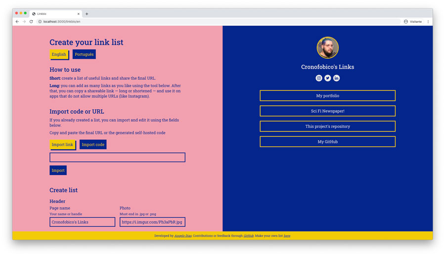
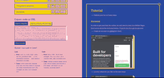

# Linkbio

> A free alternative to paid link tree websites

> Uma alternativa grátis aos sites de listas de links

- [English](#English)
- [Português](#Português)

# English

## What?

Linkbio is a free alternative to paid link tree websites, like [Linktree](https://linktree.com.br/). It's easy to use, share and even to host your own page... for free.

## Why?

Because some friends on Twitter complained about the current state of those kinds of websites and I felt compelled to make a better one, open source, and entirely for free.

Also, for portfolio. I wanted to experiment a little with design, Typescript, and some new learned React concepts.

## When?

This project was finished on August 13th, after about 30 hours of design and coding.

## Who

Linkbio was entirely made from scratch by [Angelo Dias](http://angelodias.com.br). You can browse my [GitHub](https://github.com/angelod1as) or see my Portfolio. I'm open for hire.

## How

There's a thorought tutorial on how to use the website on itself.

This website was built using `Typescript` and `React`.

- `Styled Components` for styling
- `Eslint` and `Prettier` for linting
- `i18next` for localization
- `axios` for API calls
- `VS Code` as my IDE

Most of this website was built under the influence of `Twinings Green Tea with Mint` and my [`Best Songs Ever` playlist](https://open.spotify.com/playlist/7zWHV69ACbsn0MMNkJObcS?si=43mgqaE_TyCWCwKtgUp9Kw)

## License

[GNU General Public License v3.0](https://choosealicense.com/licenses/gpl-3.0/#). Please give credits :)

### Installation

Clone this repository, run `yarn` then `yarn start`.

- `yarn build` > builds production version
- `yarn deploy` > deploys `gh-pages` branch for hosting at GitHub

There's a GitHub Action that triggers on "Master" branch push. You should check that also.

# Português

## O que?

Linkbio é uma alternativa gratuita a sites de listas de links, como [Linktree](https://linktree.com.br/). É fácil de usar, compartilhar e até de hospedar sua própria página... de graça.

## Por quê?

Porque alguns amigos reclamaram no Twitter sobre o estado atual desse tipo de sites e eu me senti compelido a criar um melhor, com código aberto e totalmente de graça.

Também, por portfolio. Queria experimentar um pouco com design, Typescript e alguns conceitos de React.

## Quando?

Este projeto foi concluído em 13 de Agosto de 2020, após em torno de 30 horas de design e código.

## Quem

Linkbio foi inteiramente feito do zero por [Angelo Dias](http://angelodias.com.br). Você pode navegar meu [GitHub](https://github.com/angelod1as) ou ver meu portfolio. Estou disponível para contratações.

## Como

Há um tutorial disponível no próprio site.

Este projeto foi construído usando `Typescript` e `React`.

- `Styled Components` para estilização
- `Eslint` and `Prettier` para _linting_
- `i18next` para localização
- `axios` para chamadas à API
- `VS Code` como meu IDE

A maior parte deste site foi construído sob a influência de `Twinings Chá Verde e Menta` e minha [playlist "Melhores"](https://open.spotify.com/playlist/7zWHV69ACbsn0MMNkJObcS?si=43mgqaE_TyCWCwKtgUp9Kw).

Most of this website was built under the influence of `Twinings Green Tea with Mint` and my ["Best Songs Ever" playlist](https://open.spotify.com/playlist/7zWHV69ACbsn0MMNkJObcS?si=43mgqaE_TyCWCwKtgUp9Kw).

## Licensa

[GNU General Public License v3.0](https://choosealicense.com/licenses/gpl-3.0/#). Por favor dê créditos :)

### Instalação

Clone este repositório, rode `yarn` e então `yarn start`.

- `yarn build` > constrói a versão de produção
- `yarn deploy` > gera o branch `gh-pages` para hospedar no GitHub

Há uma GitHub Action que aciona quando faço push no branch "Master". Você deveria checá-la também.
